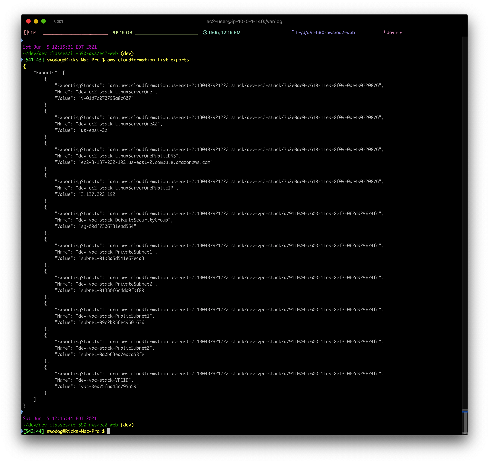
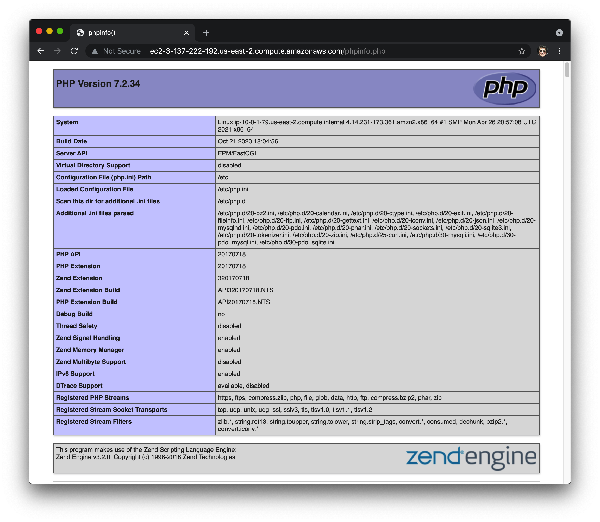

# EC2 Web Server with EFS Example

This AWS CloudFormation example deploys two Linux instances into a public subnet in the custom (non-default) VPC created with the <a href="../vpc">vpc</a> example. It uses the EC2 UserData section to add bash shell instance initialization commands to install Apache and PHP.

This example also demonstrates using Elastic File System (EFS) as a shared volume between multiple EC2 Web servers, and moving Apache document root to the webshare mount point. Again, examine the UserData sections of each EC2 Linux instance to see the code required to bootstrap the instance.

## Deploying

Deploy the efs project first:

<a href="../efs">efs</a>

From the command line run `aws cloudformation list-exports` and verify the efs stack export name.

</img>

You can then run the following command to extract the EFS file system (fs) ID from the list of exports: `aws cloudformation list-exports --query "Exports [?contains(Name,'WebFileShare')].Value" --output text` You should see an output in the form: fs-00000000 (Example: fs-075ca47c). The --query parameter uses the JAMESPath JSON query language. Click to learn more about <a href="https://jmespath.org">JAMESPath</a>

The <a href="../ec2-web-efs">ec2-web-efs</a> project's `build.sh` script *automatically* extracts the WebFileShare FS value from the list of stack exports.
From the command line run `./build.sh dev oh ec2` to deploy the ec2 dev stack into us-east-2. When the deployment script successfully completes, run `aws cloudformation list-exports` to list all stack exports. You output should be similar to, but not exactly as the following:

</img>

## Ping the Instances
Search the list of exports for **dev-ec2-stack-LinuxServerOnePublicDNS** or **dev-ec2-stack-LinuxServerOnePublicIP** and copy the Value. Examples:
`ping ec2-3-137-222-192.us-east-2.compute.amazonaws.com` or `ping 3.137.222.192` You should see responses from the server as shown below:

</img>

## Test Web Server
Open a browser and either enter the full server DNS or IP address. You should see the Apache Test page.

</img>

## PHP Info Page

Add `/phpinfo.php` to the web page URL to access the PHP Info Page:

</img>

## Adding Web Files and Scripts

There's several ways you can add web documents (files and scripts/code) to the Apache web server. 1. Create them on the server, and 2. Upload them using SCP. I'll demonstrate how to create them on the server here.

### Create on Server
SSH into one of the instances and navigate to the `/webshare/www/html` directory. Create a test.html file with vi or nano.
#### test.html
```
<!doctype html>

<html>

<head>
<meta charset="utf-8">
<title>IT-590 EFS Demo</title>

<style>
#upper-body-div {
  border: 1px solid black;
  margin-bottom: 10px;
}
</style>

<script defer src="scripts/helloworld.js"></script>
</head>

<body>
<div id="upper-body-div"></div>

</body>

</html>
```

Next, create a `scripts` directory: `mkdir scripts` and change into that directory and create a file named `helloworld.js`:
#### helloworld.js
```
(function () {
  console.log("Hello, World!");
  let d = document.getElementById("upper-body-div");
  let para = document.createElement("P");
  para.innerHTML = "Hello, World!";
  //d.getElementById("upper-body-div").appendChild(para);
  document.getElementById("upper-body-div").appendChild(para);

})();
```
## Test New Files
Open a browser and paste in one of the instance DNS names followed by test.html.
Example: http://ec2-user@ec2-18-222-39-229.us-east-2.compute.amazonaws.com/test.html

### Web Server 1
</img>

### Web Server 2
</img>
