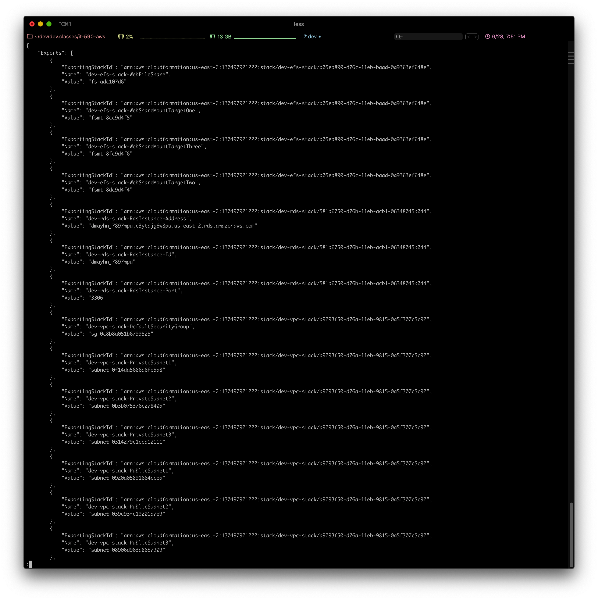
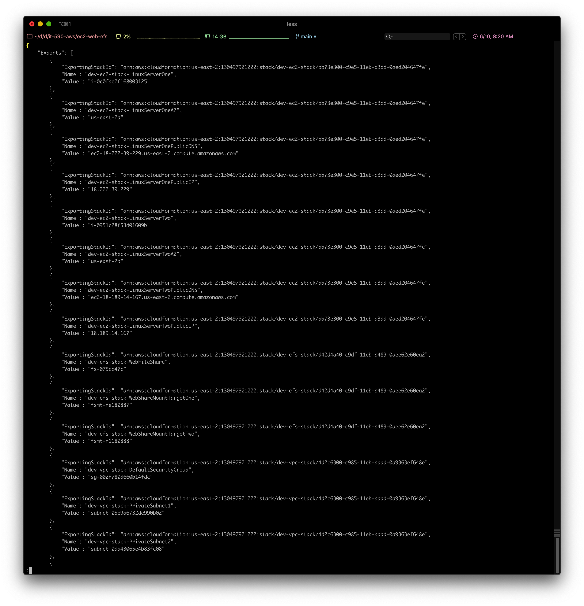
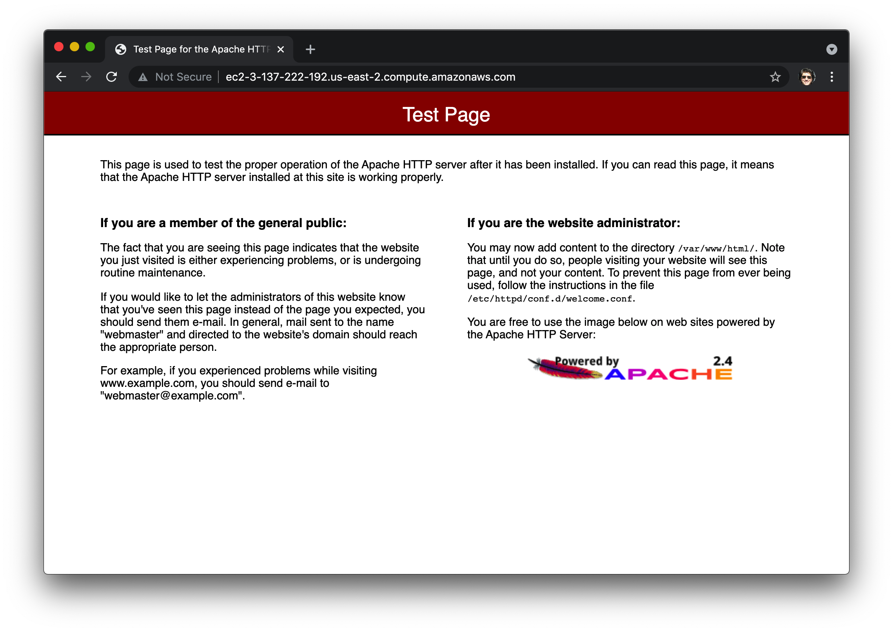
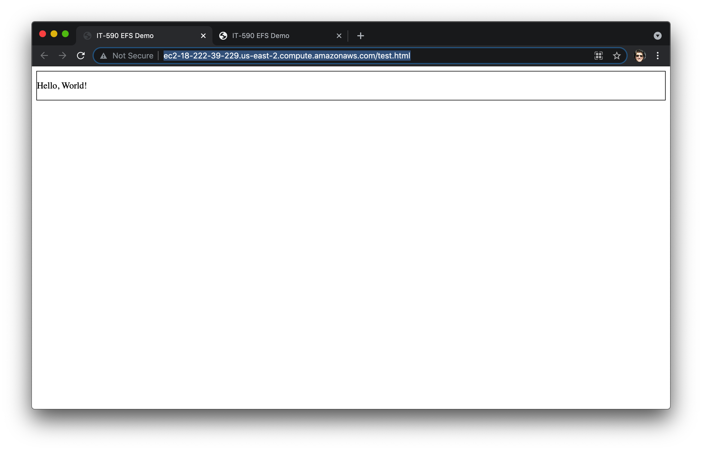
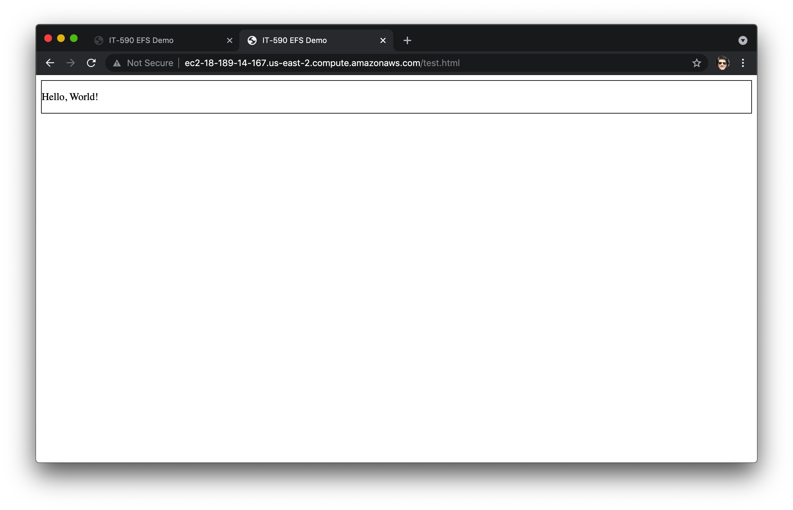
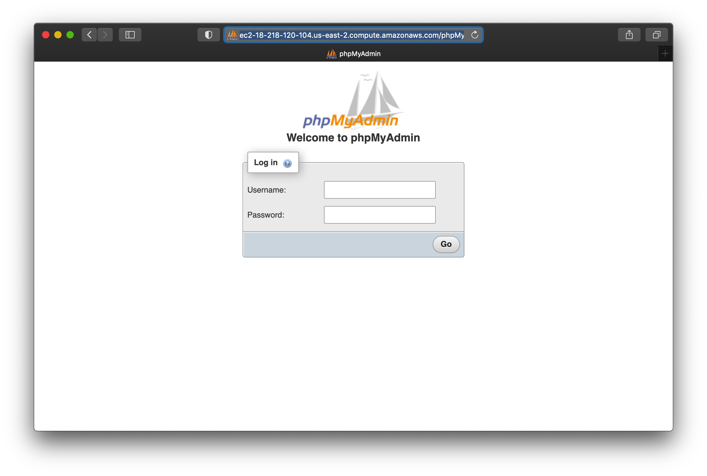
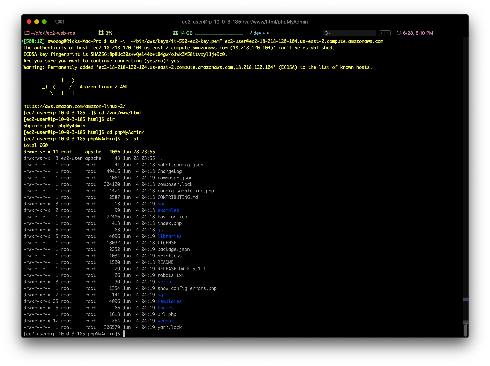
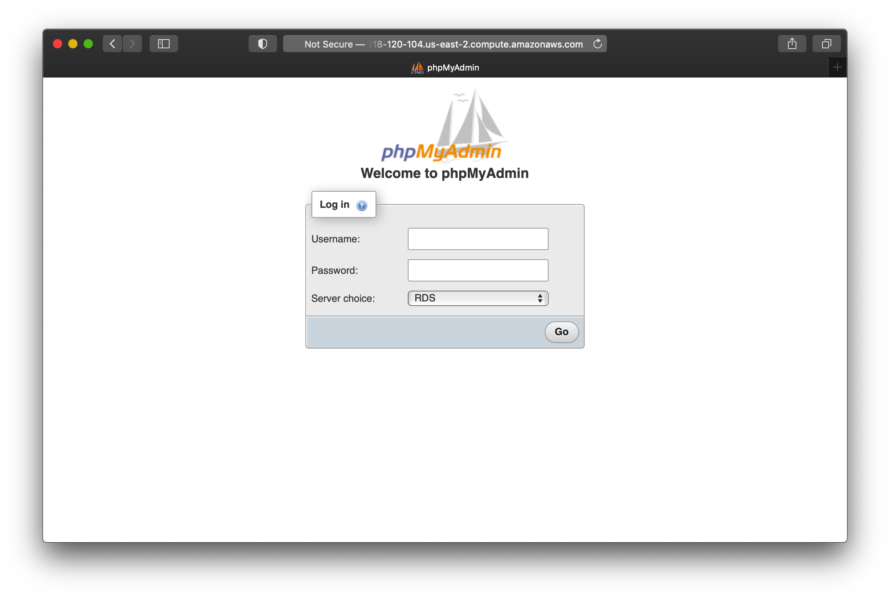
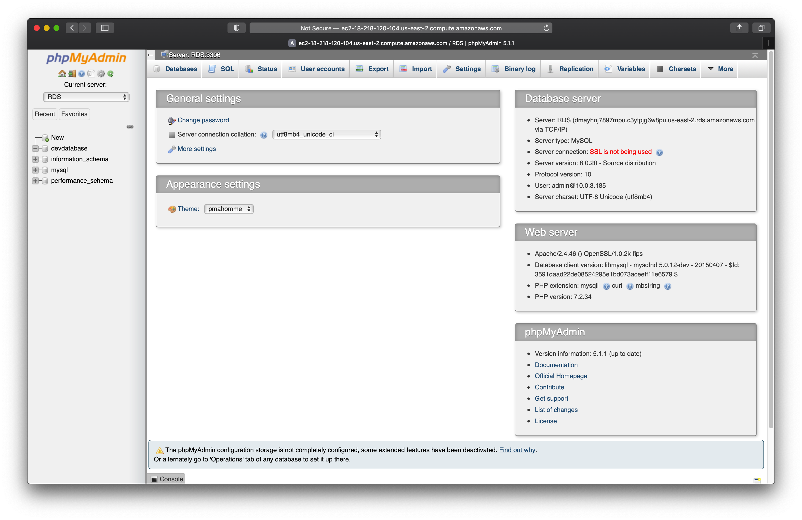

# EC2 Web Server EFS and RDS Example

This AWS CloudFormation example deploys three Linux servers into public subnets in the custom (non-default) VPC created with the <a href="../vpc">vpc</a> example.

**Two instances serve as public-facing web servers:** *LinuxServerOne* and *LinuxServerTwo*. Each uses the EC2 UserData section to add bash shell instance initialization commands to install Apache and PHP. These two web servers use an **Elastic File System (EFS)** shared volume and move the Apache document root to the `/webshare/www/html` mount point. Again, examine the UserData sections of each EC2 Linux instance to see the code required to bootstrap the web server instances.

**One instance serves as an RDS database management server:** *RDSManagementServer*. The phpMyAdmin MySQL admin web application is installed and access to the website via http port 80 & and https port 443 is limited to a known IP via the *RDSManagementSecurityGroup*, which is defined in the VPC CloudFormation template.

## Depends On: <a href="../vpc">vpc</a>, <a href="../efs">efs</a>, <a href="../rds">rds</a>

## Deploying

Prior to deploying, review/edit/customize build.sh scripts in each project as required. **Note that for the RDS project to properly deploy, you'll need to add a database password to AWS Secrets Manager in us-east-1.** Either name the secret the same name referenced in the RDS build.sh script or edit the script to reflect the secret name you used.

I recommend you delete all prior stacks as the VPC now uses three Availability Zones (AZs), and the RDS and EFS projects rely on these three AZs. Also, be sure to set the correct PEM key in the build.sh script of this project.

- Deploy the VPC project first: <a href="../vpc">vpc</a>
- Next, deploy <a href="../rds">rds</a>
- Then, deploy <a href="../efs">efs</a>

From the command line run `aws cloudformation list-exports` to verify stack export names.

</img>

You can then run the following command to extract the EFS file system (fs) ID from the list of exports: `aws cloudformation list-exports --query "Exports [?contains(Name,'WebFileShare')].Value" --output text` You should see an output in the form: fs-00000000 (Example: fs-075ca47c). The --query parameter uses the JAMESPath JSON query language. Click to learn more about <a href="https://jmespath.org">JAMESPath</a>

This project's `build.sh` script *automatically* extracts the WebFileShare FS value from the list of stack exports.
From the command line run `./build.sh dev oh ec2` to deploy the ec2 dev stack into us-east-2. When the deployment script successfully completes, run `aws cloudformation list-exports` to list all stack exports. You output should be similar to, but not exactly as the following:

</img>

## Ping the Instances
Search the list of exports for **dev-ec2-stack-LinuxServerOnePublicDNS** or **dev-ec2-stack-LinuxServerOnePublicIP** and copy the Value. Examples:
`ping ec2-3-137-222-192.us-east-2.compute.amazonaws.com` or `ping 3.137.222.192` You should see responses from the server as shown below:

</img>

## Test Web Server
Open a browser and either enter the full server DNS or IP address. You should see the Apache Test page.

</img>

## PHP Info Page

Add `/phpinfo.php` to the web page URL to access the PHP Info Page:

</img>

## Adding Web Files and Scripts

There's several ways you can add web documents (files and scripts/code) to the Apache web server. 1. Create them on the server, and 2. Upload them using SCP. I'll demonstrate how to create them on the server here.

### Create on Server
SSH into one of the instances and navigate to the `/webshare/www/html` directory. Create a test.html file with vi or nano.
#### test.html
```
<!doctype html>

<html>

<head>
<meta charset="utf-8">
<title>IT-590 EFS Demo</title>

<style>
#upper-body-div {
  border: 1px solid black;
  margin-bottom: 10px;
}
</style>

<script defer src="scripts/helloworld.js"></script>
</head>

<body>
<div id="upper-body-div"></div>

</body>

</html>
```

Next, create a `scripts` directory: `mkdir scripts` and change into that directory and create a file named `helloworld.js`:
#### helloworld.js
```
(function () {
  console.log("Hello, World!");
  let d = document.getElementById("upper-body-div");
  let para = document.createElement("P");
  para.innerHTML = "Hello, World!";
  //d.getElementById("upper-body-div").appendChild(para);
  document.getElementById("upper-body-div").appendChild(para);

})();
```
## Test New Files
Open a browser and paste in one of the instance DNS names followed by test.html.
Example: http://ec2-user@ec2-18-222-39-229.us-east-2.compute.amazonaws.com/test.html

### Web Server 1
</img>

### Web Server 2
</img>

# Configuring phpMyAdmin to Access RDS

First, copy the public DNS of the RDSManagementServer from the exports list and test the phpMyAdmin application by adding `phpMyAdmin` to the server public DNS url like this example:

`http://ec2-18-218-120-104.us-east-2.compute.amazonaws.com/phpMyAdmin/`

You should see a login screen like the one below:

</img>

**Note:** If you can't access either the Apache test page or the phpMyAdmin login screen, you may have not set your home network IP as the allowed IP in the RDSManagementSecurityGroup in the VPC CloudFormation template parameter (AllowedIP).

You need to modify the phpMyAdmin configuration file to add the RDS server to the server list. To do this, you need to SSH into the RDSManagementServer.

SSH into the RDSManagementServer and navigate to the `/var/www/html/phpMyAdmin` directory and list the directory contents with `ls -al`. Your listing will be similar to what you see below:

 </img>

 Copy the `config.sample.inc.php` file and name it `config.inc.php` like so: `sudo cp config.sample.inc.php config.inc.php` - List the directory again to verify the new file exists, then edit the  `config.inc.php` file (`sudo vi config.inc.php`) Locate the lines that say:
 ```
 /**
  * End of servers configuration
  */
 ```
 ...and just above it add the following lines:

 ```
 $i++;
 $cfg['Servers'][$i]['host'] = 'dmayhnj7897mpu.c3ytpjg6w8pu.us-east-2.rds.amazonaws.com';
 $cfg['Servers'][$i]['port'] = '3306';
 $cfg['Servers'][$i]['verbose'] = 'RDS';
 $cfg['Servers'][$i]['connect_type'] = 'tcp';
 $cfg['Servers'][$i]['extension'] = 'mysql';
 $cfg['Servers'][$i]['compress'] = TRUE;
 ```

 **Note:** You'll need to search the exports list, find the RDS Instance Address, and use it to set the `...['host']` value. Save the file, and refresh the login page. It should now have a drop-down list allowing you to select the RDS server as shown below:

 </img>

Select RDS and login with the RDS username and password (stored in Secrets Manager) used to create the RDS instance. When you log in, you should see something like this:

</img>
