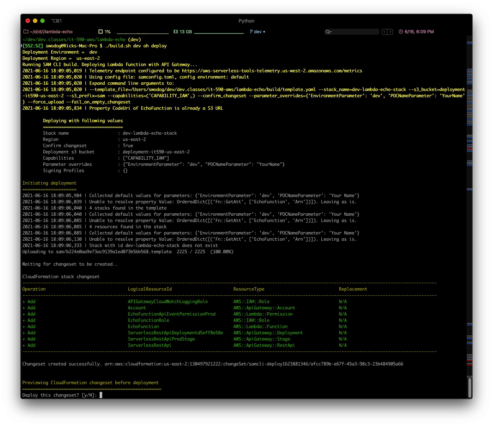

# Lambda Echo Message with Custom Rest API Application

A serverless function that echos a message submitted via a URL. This is an example of a serverless application that consists of one Lambda function and a custom Rest API and deployment stage.

---

## Preliminaries (**No need to repeat if you've already completed these from the lambda-echo example.**)

This example uses a Serverless Application Model (SAM) template which is transformed into CloudFormation before deployment. Before you attempt to run the build.sh script, you'll need to execute the following tasks:

- <a href="https://docs.aws.amazon.com/serverless-application-model/latest/developerguide/serverless-sam-cli-install.html">Install SAM CLI for your platform</a>
-- Test SAM installation by entering `sam --version`
-- The output will resemble: `SAM CLI, version 1.24.1`
- Create an S3 bucket via the AWS Management Console with a folder to hold deployment artifacts
-- Example: `my-deployment-bucket-us-east-1/sam`
- Edit the build.sh file
-- Change the bucket name and prefix to reflect the bucket and folder you created above

## Deploying

Deploying actually consists of two steps:
- Package
-- Run `./build.sh dev oh package`
- Deploy
-- Run `./build.sh dev oh deploy`

If all goes well, you will need to approve the change set:

</img>

Enter 'y'
If everything deploys successfully, your output will resemble the following:

</img>

## Testing The Message Echo Function
Get the URL from the last template Output shown above.
Example:
`https://4firoj0ehc.execute-api.us-east-2.amazonaws.com/Prod/echo?message=This works!`
...and paste it into the browser and hit return.You should see the reply:
</img>

Experiment with different message parameters.
