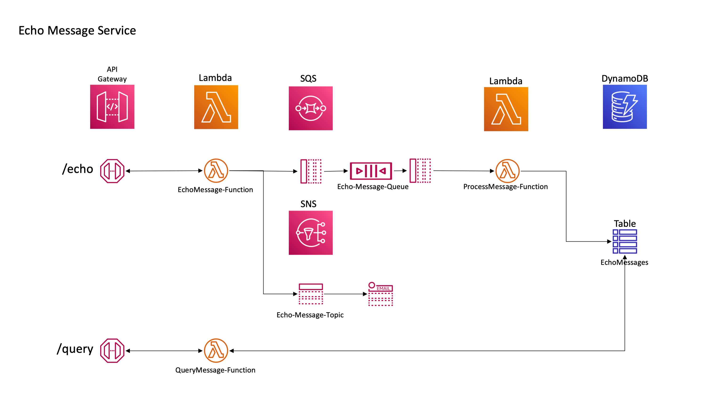
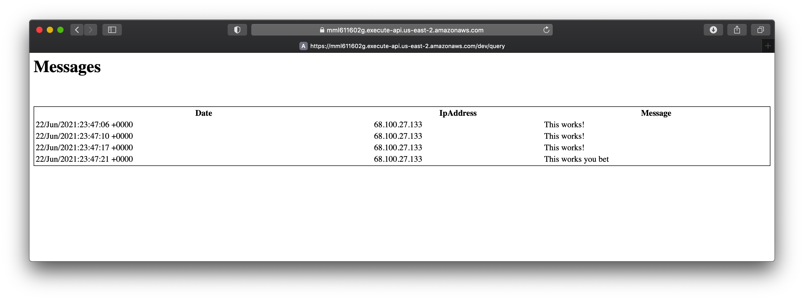

# Serverless Application with SNS, SQS, and DynamoDB

This is an example of a serverless application that consists of multiple lambda functions, a custom Rest API and deployment stage, SNS topic, SQS Queue, and a DynamoDB table with Global and Local secondary indexes.

---

## Depends On:  
- <a href="../sns">sns example</a>  
- <a href="../sqs">sqs example</a>  
- <a href="../dynamodb">dynamodb example</a>  

Deploy the service examples listed above. Be sure to use a valid subscription email for the SNS service as you'll need to verify the subscription.

## Architecture Diagram

Referring to the architecuture diagram above, the application implements two processing pipelines:
- The /echo endpoint enables message submission and passes the URL `message` parameter to the EchoMessage lambda function. The lambda function pushes the message text onto an SQS queue, and publishes the message text to an SNS topic, which sends an email notification to the subscription email address. The ProcessMessage lambda function takes messages off the queue and inserts them into the EchoMessages DynamoDB table.
- The /query endpoint simply scans the entire DynamoDB table and returns all messages formatted as an HTML table.

## Preliminaries
(**No need to repeat if you've already completed these from the lambda-echo example.**)

This example uses a Serverless Application Model (SAM) template which is transformed into CloudFormation before deployment. Before you attempt to run the build.sh script, you'll need to execute the following tasks:

- <a href="https://docs.aws.amazon.com/serverless-application-model/latest/developerguide/serverless-sam-cli-install.html">Install SAM CLI for your platform</a>
-- Test SAM installation by entering `sam --version`
-- The output will resemble: `SAM CLI, version 1.24.1`
- Create an S3 bucket via the AWS Management Console with a folder to hold deployment artifacts
-- Example: `my-deployment-bucket-us-east-1/sam`
- Edit the build.sh file
-- Change the bucket name and prefix to reflect the bucket and folder you created above

## Deploying

Deploying actually consists of two steps:
- Package
-- Run `./build.sh dev oh package`
- Deploy
-- Run `./build.sh dev oh deploy`

If all goes well, you will need to approve the change set:

</img>

Enter 'y'
If everything deploys successfully, your output will resemble the following:

</img>

## Testing The Message Echo Function
Get the URL from the last template Output shown above.
Example:
`https://4firoj0ehc.execute-api.us-east-2.amazonaws.com/Prod/echo?message=This works!`
...and paste it into the browser and hit return.You should see the reply:
</img>

Experiment with different message parameters. Check your email...you should have a message.

To query messages, use the /query endpoint — Example: `https://mml611602g.execute-api.us-east-2.amazonaws.com/dev/query` ...will return something similar to:

</img>
