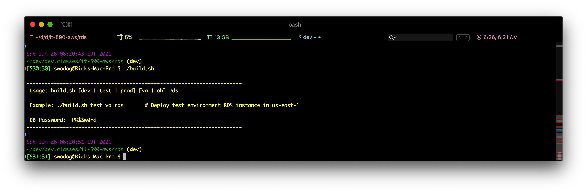

# RDS

Creates an RDS database instance

## Depends On:

- An **AWS Secrets Manager** secret named `db_password` must exist in the Northern Virginia Region (us-east-1)
- The `build.sh` script extracts the password value from the secret using a JSON parsing utility called <a href="https://stedolan.github.io/jq/">jq</a>
-- Ensure you install <a href="https://stedolan.github.io/jq/">jq</a> before you run the `build.sh`

If everything is configured correctly you will see the database password when you run `build.sh` with no arguments:
</img>
