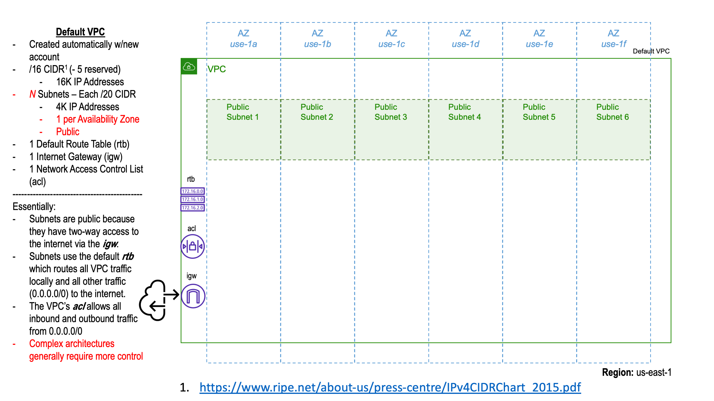
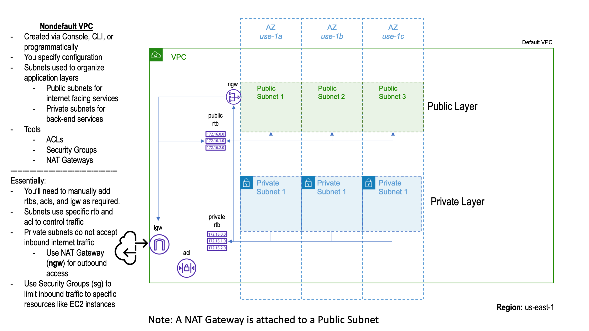

# Virtual Private Cloud (VPC)

Define a VPC with CloudFormation template and deploy via bash script `build.sh`

# Default VPC
---------
All new AWS accounts come with a default VPC in each region. Pictured below is a default VPC in us-east-1. The default VPC in each region contains a subnet in every avaibalility zone. The network access control list allows inbound and outbound traffic from all IPs (0.0.0.0/0), and the default route table enables communication between resources within and between subnets and forwards outbound traffic to the internet gateway.
</img>
This works fine for simple deployments but for most applications, you need more control over network security and application deployment configurations. That's a job for a custom VPC.

# Custom VPC
------------
Pictured below is a custom VPC that has both public and private subnets. A subnet is public if it accepts inbound traffic from the internet, and a subnet is private if it does not, or otherwise restricts inbound public traffic. A private subnet uses a NAT gateway to enable outbound traffic to the internet. To access resources within a private subnet, say an EC2 instance, you can use a bastion host or session manager.
</img>
